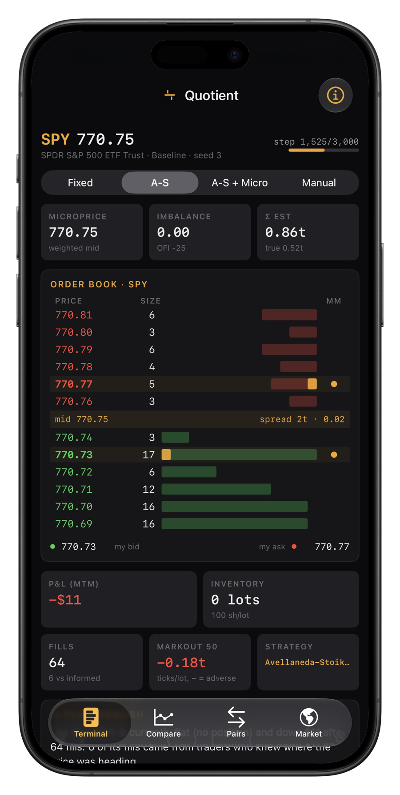
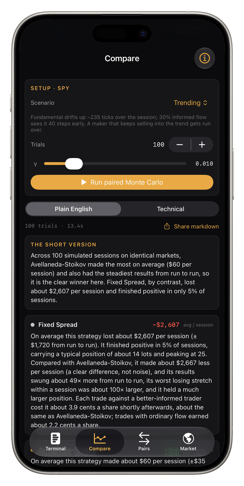
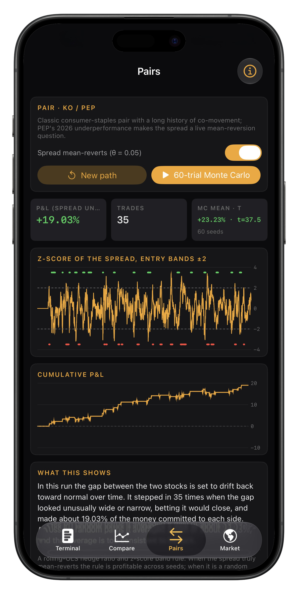
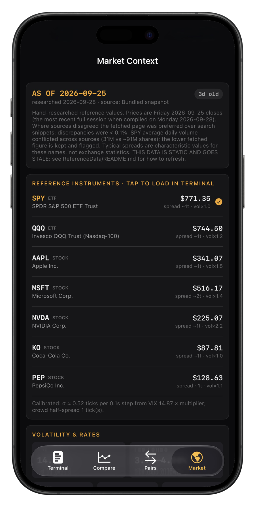

# Quotient

A market-making simulation in Swift, shipped as an iOS app.

Quotient implements a price-time-priority limit order book, a market simulator
with planted adverse selection and inventory risk, three market-making
strategies of increasing sophistication, and a paired Monte Carlo evaluation
with significance tests. The algorithm lives in its own Swift package,
[`QuotientCore/`](QuotientCore/), which builds and tests on macOS with a plain
`swift test`. The iOS app is the demonstration layer.

**This is an implementation of published market-making theory under stated
assumptions. It is not a trading system, it is not a claim of real-market
profitability, and it does not reproduce any firm's proprietary strategy.**

<p align="center">
  
</p>
<p align="center"><em>Terminal: a live simulated SPY book. The maker's bid and ask are the amber-marked levels; the fills, markout and inventory tiles update every step.</em></p>

<p align="center">
  
  &nbsp;
  
  &nbsp;
  
</p>
<p align="center"><em>Left: paired Monte Carlo on the Trending regime, explained in plain English (a Technical toggle shows the full stat grid). Centre: KO/PEP pairs trading with its random-walk negative control. Right: the dated market snapshot every number is calibrated from.</em></p>

## About this project

**Quotient was built with AI.** It began as an experiment: how far could a
single, detailed brief taken by Anthropic's Claude Fable 5.1 get toward a
production-quality market-making simulation, complete with tests, honest
evaluation and documentation? The answer is this repository. The model wrote
the code, the tests and the documentation from that brief, researched the
theory and the market snapshot, and found and fixed the bugs listed below
during development. The brief, the direction, the review, the product
decisions, the app icon and the decision about what to ship are mine, and so
is the responsibility for understanding every line of it.

I'm **David De La Rosa**, a Computer Science undergraduate with a Mathematics
minor and a software engineering intern working in iOS/Swift. I built this
while preparing for quantitative trading and quant developer internship
applications, and I use it as the thing I explain in interviews: the order
book design, why Avellaneda-Stoikov skews quotes, what a markout measures,
and why the naive strategy's higher average P&L is not the point.

If you're evaluating this as a work sample, the honest framing is: I can
defend every design decision in it, and I know exactly where the textbook
model stops and the real problem begins. See
[`docs/SUMMARY.md`](docs/SUMMARY.md) for that discussion.

## What's in the box

| Layer | Where | What it does |
|---|---|---|
| Order book / matching engine | [`OrderBook/`](QuotientCore/Sources/QuotientCore/OrderBook/) | Price-time priority, limit / market / cancel / partial fills, O(1) amortised cancel, invariant checker. Header comment is the "design an order book" answer. |
| Signals | [`Signals/`](QuotientCore/Sources/QuotientCore/Signals/) | Depth imbalance, order-flow imbalance (Cont-Kukanov-Stoikov), Stoikov microprice estimated online from a Markov chain of book states, EWMA volatility, intensity calibration. |
| Simulator | [`Simulation/`](QuotientCore/Sources/QuotientCore/Simulation/) | Latent fundamental with jumps, delayed public price, background liquidity ladder, Poisson aggressive flow with Glosten-Milgrom informed traders. Three independent seeded RNG streams so every strategy faces the identical market. |
| Strategies | [`Strategies/`](QuotientCore/Sources/QuotientCore/Strategies/) | Fixed spread (Level 1), Avellaneda-Stoikov (Level 2), Avellaneda-Stoikov on the microprice (Level 3), a manual maker for the app, and a pairs-trading module with a negative control. |
| Evaluation | [`Evaluation/`](QuotientCore/Sources/QuotientCore/Evaluation/) | Sharpe, drawdown, RMS inventory, markouts by counterparty, P&L decomposition, paired Monte Carlo with paired t-tests, Markdown report generator. |
| Market data | [`MarketData/`](QuotientCore/Sources/QuotientCore/MarketData/) | `MarketDataSource` protocol, a dated hard-coded snapshot of real levels, calibration from VIX to per-step σ. |
| App | [`Quotient/`](Quotient/) | SwiftUI: live order book terminal with strategy switching and manual mode, on-device paired Monte Carlo, pairs demo, market-context screen. |

## The theory implemented

Full citations with URLs in [`docs/RESEARCH.md`](docs/RESEARCH.md).

- **Avellaneda & Stoikov (2008)**, *Quantitative Finance* 8(3). Reservation price
  `r = s − q·γ·σ²·(T−t)` and total spread `γ·σ²·(T−t) + (2/γ)·ln(1 + γ/k)`,
  implemented literally in ticks-and-steps units in
  [`AvellanedaStoikovMarketMaker.swift`](QuotientCore/Sources/QuotientCore/Strategies/AvellanedaStoikovMarketMaker.swift).
  σ is estimated online, never read from the simulator. The horizon is a
  rolling constant by default (the paper's finite horizon is available and
  tested; it makes the maker collapse to symmetric quotes at the close).
- **Glosten & Milgrom (1985)**, *J. Financial Economics* 14(1). A fraction μ of
  arriving traders know the fundamental before the public price reflects it and
  trade only when a quote is mispriced against it. The simulator implements
  this mechanically; markouts on the maker's fills against them measure the
  adverse-selection cost.
- **Stoikov (2018)**, *Quantitative Finance* 18(12). The microprice as the
  expected mid after imbalance resolves, estimated from transition counts
  between (imbalance, spread) states:
  [`MicropriceEstimator.swift`](QuotientCore/Sources/QuotientCore/Signals/MicropriceEstimator.swift).
- **Cont, Kukanov & Stoikov (2014)**, *J. Financial Econometrics* 12(1).
  Order-flow imbalance at the best quotes.
- **Guéant, Lehalle & Fernandez-Tapia (2013)** and **Cartea, Jaimungal &
  Penalva (2015)** inform the hard inventory bound and the idea of shifting the
  reference price with a short-term signal. The microprice-centred variant is
  an extension in that spirit, not a reproduction of a named model.

## What the results show

Generated by the code (`ResultsReportTests`), 200 paired trials per regime,
full tables in [`docs/RESULTS.md`](docs/RESULTS.md). The fixed-spread control is
matched to the A-S spread at zero inventory so spread width is not the
explanation.

| Regime | Fixed spread | Avellaneda-Stoikov | Takeaway |
|---|---|---|---|
| Baseline, 20% informed | $674 ± 375, session Sharpe 2.0, RMS inventory 11 lots | $564 ± 87, Sharpe 12.0, RMS inventory 0.75 | Naive earns more on average (p<0.0001) with 4x the sd and 15x the drawdown. |
| Inventory only, μ = 0 | $1,485 ± 580, max |inventory| 44 | $1,001 ± 78, Sharpe 20 | Pure Avellaneda-Stoikov setting. Skew trades mean for variance. |
| Adverse selection, 45% informed | −$84 ± 1,052 | $2 ± 91 | Everyone is picked off (markout vs informed −4 to −6 ticks). A-S only loses with less variance. |
| Trending | −$17,940 ± 6,353, 0% win, RMS inventory 120 | $529 ± 75, 100% win | The instructive failure: the naive maker sells into the trend all session. |
| News heavy | −$433 ± 622 | −$364 ± 73, 0% win | Nobody survives stale quotes through jumps. Spread width does not fix an information delay. |

Honest surprises, discussed in [`docs/SUMMARY.md`](docs/SUMMARY.md):

1. The naive maker is frequently the highest-mean strategy. The case for
   Avellaneda-Stoikov is risk-adjusted, not raw P&L.
2. Centring on the microprice is not uniformly better. It helps a little where
   informed flow makes imbalance informative (Baseline, Trending) and hurts
   where it doesn't (Inventory Only, −$146 per session, p<0.0001).
3. Markouts split by counterparty behave exactly as Glosten-Milgrom predicts:
   negative against informed traders, positive against noise traders, in
   every regime and for every strategy.

## Running it

**Core package (macOS, no simulator needed):**

```bash
cd QuotientCore
swift test                 # 76 tests: order book, signals, strategies, simulator, evaluation, data, pairs
QUOTIENT_RESULTS_PATH=../docs/RESULTS.md swift test -c release --filter ResultsReport   # regenerate results tables
```

**App:** open `Quotient.xcodeproj`, select the Quotient scheme and an iOS 27
simulator, run. The package is linked as a local Swift package dependency. App
integration tests live in `QuotientTests`.

The Terminal tab runs the simulation live. Switch between Fixed, A-S,
A-S + Micro and Manual while the same order flow keeps arriving; change γ and
the informed fraction with the sliders; pick a scenario preset. The Compare
tab runs the paired Monte Carlo on device and can share the Markdown report.
The Market tab shows the snapshot the simulation is calibrated from and lets
you pick the instrument.

## Plain-English layer

Compare, Pairs and Terminal can explain their results in prose for readers
without a quant background, with a Plain English / Technical toggle on the
Compare screen and an ⓘ glossary on each screen. The prose is generated in
`QuotientCore` from the same result structs the technical grid displays, so it
can never disagree with the numbers. How it works and how to extend it:
[`docs/PLAIN_ENGLISH.md`](docs/PLAIN_ENGLISH.md).

## Design notes worth reading

- [`OrderBook.swift`](QuotientCore/Sources/QuotientCore/OrderBook/OrderBook.swift):
  data-structure choice, complexity of every operation, alternatives
  considered, ordering guarantees and failure modes.
- [`MarketSimulator.swift`](QuotientCore/Sources/QuotientCore/Simulation/MarketSimulator.swift):
  why there are three RNG streams and why the maker sees the market
  *excluding its own orders*.
- [`MonteCarlo.swift`](QuotientCore/Sources/QuotientCore/Evaluation/MonteCarlo.swift):
  why paired comparison with common random numbers rather than independent runs.
- [`SimulationParameters.swift`](QuotientCore/Sources/QuotientCore/Simulation/SimulationParameters.swift):
  every knob, with what it controls and why the default is what it is.

## Bugs found during development

Each has a regression test named in the code comment at the fix site:

1. **Self-referential mid feedback loop** ran the mid to −6.7 million ticks.
   Strategies now see the mid excluding their own orders.
2. **Self-trade on re-quote** when a large skew crossed the maker's own stale
   ask. Stale sides are now cancelled before any new order is placed.
3. **Crowd RNG desynchronised by the maker's own fills**, silently breaking
   "same seed, same market." Draw counts per step are now fixed.
4. **Non-tradable pairs P&L** accrued on a re-fitted residual; the θ = 0
   negative control exposed it. β is now locked at entry.
5. **σ inflated ~40% by the maker's own quote flicker.** Volatility is now
   estimated on the external mid.

## Market snapshot and how to refresh it

The simulation's starting mid, volatility and spread come from
[`market_snapshot.json`](QuotientCore/Sources/QuotientCore/MarketData/ReferenceData/market_snapshot.json),
researched **2026-09-28** and describing the **2026-09-25** close: SPY $771.35,
QQQ $744.50, AAPL $341.07, MSFT $516.17, NVDA $225.07, KO $87.81, PEP $128.63;
VIX 14.87; fed funds 3.75–4.00% after a 25 bp hike on 2026-09-16; 10Y 5.18%.
Every figure carries a source URL and date in the file. The app flags the
snapshot as stale after 14 days.

- **Refresh the numbers:** edit that one JSON file. Step-by-step in
  [`ReferenceData/README.md`](QuotientCore/Sources/QuotientCore/MarketData/ReferenceData/README.md).
- **Go live:** implement `MarketDataSource` (one `async throws` method
  returning a `MarketSnapshot`) and construct it in `AppModel` instead of
  `BundledSnapshotDataSource`. Nothing in the simulator, strategies or
  evaluation changes.

Calibration maps VIX × a per-instrument multiplier to per-step σ via
√(steps per trading year), then applies a documented high-frequency dampening
factor (0.35), because √t scaling of implied vol badly overstates how much a
tick-constrained mid actually moves in 100 ms. Both are stated approximations,
not fits; the factor is a named constant in `Calibration.swift` and setting it
to 1.0 shows the unadjusted case, in which every strategy is picked off in
every regime.

## Known simplifications

- Prices are on a 1¢ grid; the half-penny tick regime for tick-constrained
  names is noted in the snapshot but not modelled.
- No latency, no queue-position model beyond FIFO, no fees or rebates, no
  self-trade prevention at the venue level.
- The background crowd re-centres on a lagged fundamental with a fixed ladder
  shape; it does not learn or compete.
- Informed traders are the only source of permanent price impact; uninformed
  flow has none.
- σ is a single EWMA; jumps inflate it, which is why A-S quotes 15 ticks wide
  in the News Heavy regime.
- Session Sharpe is a per-session t-statistic on sub-second P&L increments,
  not an annualised figure.
- The A-S fill-intensity parameter k is a documented default (1.0/tick), with
  an `IntensityCalibrator` provided but not wired into the strategy.

## Roadmap

1. `LiveMarketDataSource` for reference levels (the protocol is in place).
2. A replay driver that feeds recorded L2 data through `MarketState`, replacing
   `MarketSimulator` for historical evaluation.
3. Port the matching engine's hot path to a tick-indexed C++ or Rust ladder and
   benchmark messages/second against the Swift implementation.
4. Latency, queue position, fees; jump detection that pulls quotes.
5. Guéant-Lehalle-Fernandez-Tapia bounded-inventory quotes and a
   Cartea-Jaimungal running inventory penalty as further strategies.

## Repository layout

```
Quotient.xcodeproj          iOS app project (links QuotientCore as a local package)
Quotient/                   SwiftUI app: Terminal, Compare, Pairs, Market screens
QuotientTests/              app-level integration tests
QuotientCore/               the algorithm — its own Swift package, `swift test`
docs/RESEARCH.md            theory, interview framing, open-source landscape, with citations
docs/RESULTS.md             generated Monte Carlo tables
docs/SUMMARY.md             written summary and interview talking points
```
